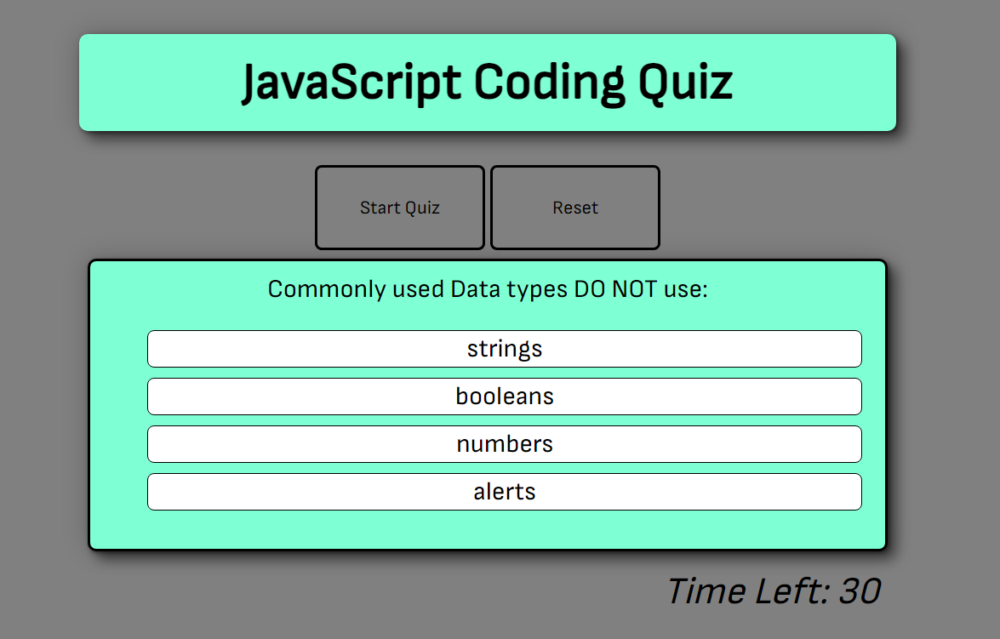

# JavaScript Quiz
 ## About
 This JavaScript quiz demonstrates the use of JavaScript logic consisting of: Event listeners, Query selectors, Events and more. 
 
 List items have been added dynamically using 
 ``` Js
var createLi = document.createElement("li");
        var scoreList = document.querySelector("#scoreList");
        createLi.textContent = "Name: " + allScores[i].initials + " " + "score: " + allScores[i].score;
        scoreList.appendChild(createLi);
 ```

# Usage
 By clicking the start button you will be presented with a question and 4 options, with only of them being correct, if you select the correct answer "Correct!" will be displayed, otherwise "Wrong!" will be shown.

 Each wrong answer entered will result in 15 seconds being removed from the timer, the time left on the counter will be your final score.

 Enter your initials in the label element to post scores to the Leaderboard, click the "clear" button to clear the leaderboard.

## Known issues
 <li>Adds two scores when submitting initials in Highscores</li>
 <li>reset button not functional</li>

# Licence
MIT Licence.

Live page link: 


